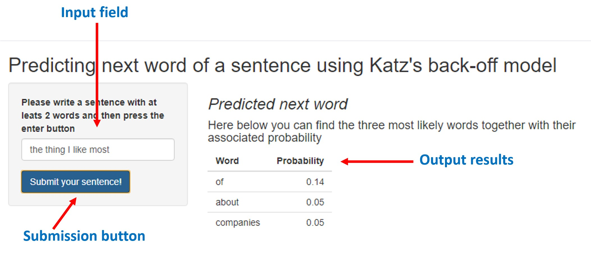

```{r setup, include=FALSE}
knitr::opts_chunk$set(echo = FALSE)
```

## Goal of the project

The goal of the project is to build a R **Shiny application** able to **predict the next word** 
in a sentence.

## Input required to build the underlying model
- Training data were obtained from:
    + Blogs
    + News
    + Tweets
- The data were cleaned and sampled
- The Tri-grams, Bi-grams and One-grams of the sample dataset were obtainined 
together with their frequency
- The latter were saved as an .RData file.

## Model used
- A [Katz's back-off model](https://en.wikipedia.org/wiki/Katz%27s_back-off_model) was implemented
- The model is used to predict the most probable next word (or words)
- The model uses bigrams to estimate the probability of seen and unseen trigrams 
and bigrams 

## [The Shiny app](insert link)
- The app is available at the following [link](insert link)
- On the left side an input window allows inserting the text to be used for the 
prediction
- Then, the submit button has to be pressed
- On the rigth side the output will display the three most likely words according 
to the Katz's model together with their associated probability.  
{width=70%}  
Full code available on [GitHub](https://github.com/Cippa/Coursera-Data-Science-Capstone)  

